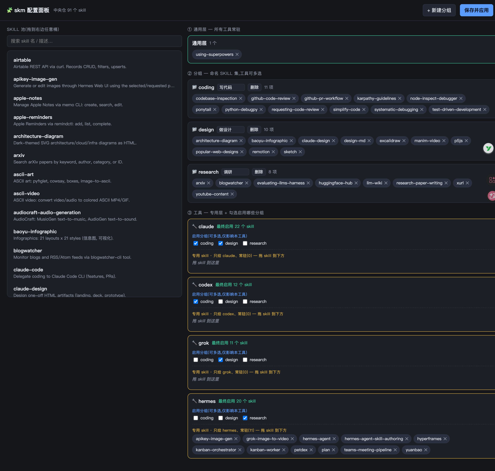

# skm — 跨工具 Skill 管理器

[](https://github.com/Oneideals/skm/actions/workflows/ci.yml)
[](LICENSE)
[](https://www.python.org/)

> 一份 skill 装一次,四个 AI CLI 工具(Claude Code / Codex / Grok / Hermes)通用;按**分组**成组启停 skill,只让当前需要的进上下文。

`skm`(**sk**ill **m**anager)是一个零依赖的 Python 命令行工具,用一个中央仓 + 软链接,把 skill 分发给多个 AI 编码工具,并让你按"通用层 / 工具专用层 / 可多选分组"三个维度精确控制**每个工具在每次会话里加载哪些 skill**。



> `skm panel` 可视化面板:左边是 skill 池,右边三层 —— **① 通用层**(所有工具常驻)、**② 分组**(命名 skill 集)、**③ 每个工具**勾选启用哪些分组 + 自己的专用层。图中 Claude 开了 coding+design、Codex 只 coding、Grok 只 design、Hermes 开 research 且自带 11 个专属 skill。

---

## 为什么需要它

如果你同时在用多个 AI CLI 工具,会遇到两个痛点:

1. **Skill 集合无法成组启停,且白占上下文。**
   有的 skill 是"集合"(比如 [superpowers](https://github.com/obra/superpowers) 含 14 个 skill),整体使用才有意义。但工具在会话启动时,会把 `skills/` 目录下**每个** skill 的名称和描述注入系统提示——装得越多,常驻上下文越大。你需要的是"这次做调研就只加载调研相关的 skill",而不是把几十上百个 skill 的描述全部塞进每一次会话。

2. **同一个 skill 要在每个工具里装一遍。**
   Claude Code、Codex、Grok、Hermes 各有各的 `skills/` 目录。装一个 skill 得复制四份,更新时要同步四处。

`skm` 用一个中央仓统一存放 skill,通过软链接分发给各工具,并用声明式配置控制"谁、在什么场景下、加载哪些",一次安装、处处可用、按需启停。

---

## 核心模型:三层

某个工具在某次会话里最终加载的 skill,由三部分并集组成:

```
最终启用的 skill  =  通用层(universal)
                  ∪  该工具专用层(tool-specific)
                  ∪  ⋃(该工具勾选的各个分组 group)
```

| 层 | 含义 | 例子 |
|----|------|------|
| **通用层 universal** | 所有工具都常驻的 skill | `using-superpowers` |
| **工具专用层 tool-specific** | 只给某个工具、常驻的 skill | Hermes 专属的 `hermes-agent`、`petdex` 只给 Hermes |
| **分组 group** | 命名的 skill 集,**一个工具可同时勾选多个** | `coding`、`design`、`research` |

**关键设计:**

- **按工具分别切** —— 每个工具独立持有自己勾选的分组。可以让 Claude 开 `coding`+`design`,同时 Codex 只开 `coding`,Hermes 开 `research`,互不干扰。
- **下次启动生效** —— 启停的本质是软链接的增删,发生在文件系统层面;因为工具在会话**启动时**一次性扫描 `skills/` 目录,所以切换后需重启对应工具的会话才生效(这也是它能真正节省上下文的原因——名册在启动那一刻就冻结了)。

---

## 特性

- 🗂 **一个中央仓**:所有 skill 存 `~/.skm/skills/`,四个工具靠软链接共享,装一次处处可用。
- 🎚 **三层精确控制**:通用 / 工具专用 / 多选分组,精确到"每个工具加载哪些"。
- 🧩 **成组启停**:按分组整组启用/禁用,不用的分组不占上下文。
- 🖱 **可视化面板**:`skm panel` 打开浏览器,拖拽把 skill 组织进分组、给每个工具勾选分组,保存即应用。
- 📦 **导入集合**:`skm import <git-url>` 一键导入 GitHub 上的 skill 仓库为一个分组。
- 🛡 **安全**:删除软链接需三重校验,你手工放的目录、别的工具建的链接永不被误删;每次切换自动备份,可一键回滚。
- 🪶 **零运行时依赖**:纯 Python 标准库(需 Python ≥ 3.11)。

---

## 安装

```bash
# 1. 克隆
git clone https://github.com/Oneideals/skm.git
cd skm

# 2. 把 skm 加入 PATH(bin/skm 用系统 python3,无需虚拟环境)
ln -sf "$PWD/bin/skm" ~/.local/bin/skm     # 确保 ~/.local/bin 在你的 PATH 里

# 3. 验证
skm --help
```

首次运行任意命令会自动在 `~/.skm/` 生成默认配置。中央仓与配置目录可用 `SKM_HOME` 环境变量覆盖。

**要求**:Python ≥ 3.11(用到 `tomllib`)。运行时零第三方依赖;`pytest` 仅开发测试用。

---

## 快速上手

```bash
# 把本地 skill 装进中央仓
skm install /path/to/some-skill

# 或从 GitHub 导入一整个 skill 仓库为一个分组(pack)
skm import https://github.com/obra/superpowers

# 让 Claude 同时启用 coding 和 design 两个分组
skm use claude coding design

# 让 Hermes 只启用 research
skm use hermes research

# 看四个工具各自的三层现状
skm list

# 切换后重启对应工具的会话即可生效
```

---

## 命令参考

```
# —— 启停(核心)——
skm use <tool> [group...]      设定某工具启用哪些分组(可多个;不给分组=清空到只剩通用+专用层)
skm use all <group>            便捷:所有工具都设为某分组
skm enable <tool> <group>      给某工具增开一个分组
skm disable <tool> <group>     给某工具关掉一个分组
skm reset <tool>               清空该工具所有分组(保留通用层 + 专用层)
skm rollback <tool>            回滚到该工具上次切换前的状态

# —— 安装 / 来源 ——
skm install <path>             把单个本地 skill 装进中央仓
skm import <url> [--split-by-dir] [--name N]
                               导入 git 仓库为分组;--split-by-dir 按子目录拆成多个分组
skm pack create <name> --skills a,b,c
                               手挑若干 skill 组成一个集合(pack)
skm upgrade <pack>             按来源 URL 重新拉取更新一个 pack

# —— 查看 / 体检 ——
skm list                       各工具三层现状(通用 N + 专用 M + 分组[...])
skm groups                     列出所有分组
skm packs                      列出所有集合(pack)
skm doctor                     健康检查:断链、孤儿链、缺失 skill
skm panel [--port N] [--no-open]
                               打开可视化配置面板
```

> **分组(group)与集合(pack)的区别**:pack 是"一堆 skill 的命名集合"(通常来自 `import` 的一个仓库);group 是"工具可勾选的启用单元",可以直接包含 skill,也可以引用若干 pack。日常用 group 组织,pack 用于承载导入的现成集合。

---

## 可视化面板

```bash
skm panel                      # 浏览器打开 http://127.0.0.1:8787
skm panel --port 9000 --no-open
```

面板是一个自包含的单页应用(Python 标准库 `http.server` 起服务,零前端依赖),分三个区:

1. **① 通用层** —— 拖 skill 进来 = 所有工具常驻。
2. **② 分组** —— 新建分组,拖 skill 定义每个分组装什么。
3. **③ 工具** —— 每个工具一张卡:上半勾选**启用哪些分组**(仅影响本工具),下半是它的**专用 skill**(拖入,只给这个工具常驻);右上角实时显示"最终启用 N 个 skill"。

点**保存并应用** = 写回 `config.toml` 并对每个工具按其勾选的分组重算软链接(之后重启对应工具生效)。

---

## 配置文件 `~/.skm/config.toml`

```toml
[universal]                        # 通用层:所有工具常驻
skills = ["using-superpowers"]

[tools.claude]                     # 每个工具:路径 + 专用层
path = "~/.claude/skills"
skills = []

[tools.hermes]
path = "~/.hermes/skills"
skills = ["hermes-agent", "petdex"]   # 只给 Hermes 常驻

[packs.superpowers]                # 集合:通常来自 import
skills = ["brainstorming", "test-driven-development", "..."]
source = "https://github.com/obra/superpowers"

[groups.coding]                    # 分组:命名 skill 集,工具可多选
label = "写代码"                    # 中文名仅用于显示,命令参数用英文 id
skills = ["systematic-debugging", "simplify-code"]
packs = ["superpowers"]            # 也可引用整个 pack
```

- 标识符(skill / pack / group 名)一律**英文小写 + 短横线**;分组可额外带一个 `label` 中文名用于面板显示。
- 引用了中央仓里不存在的 skill 会在加载/切换时报错,不会静默跳过。

---

## 工作原理

**分发 = 软链接。** 某个 skill 在某工具"启用",就是在那个工具的 `skills/` 目录里建一条指向中央仓 `~/.skm/skills/<skill>` 的软链接;"禁用"就是删掉这条链接。四个工具的 skill 加载机制高度一致(目录里有这个文件夹 = 加载),所以一个软链接动作四个工具通吃。

**为什么"下次启动生效"。** 工具在会话启动时一次性扫描 `skills/` 目录,把每个 skill 的名称+描述注入系统提示(这是常驻上下文开销的来源)。会话跑起来后名册就冻结了,所以切换后要重启会话。也正因如此,控制"启动时进入名册的 skill 有哪些"是真正能省上下文的唯一杠杆。

**安全保证。** 删除一条软链接需**三重校验**同时满足:① 在 skm 的状态记录里 ② 确实是软链接 ③ 链接目标位于 `~/.skm/skills/` 下。任一不满足就跳过并警告——你手工放进 `skills/` 的真实目录、别的工具建的软链接,永远不会被 skm 删除。每次切换前自动把当前状态快照写入 `~/.skm/backups/`,`skm rollback` 可逆。

**目录布局:**

```
~/.skm/
├── skills/        中央仓:所有 skill 的真身(扁平,一层)
├── config.toml    声明式配置:universal / tools / packs / groups
├── state.json     运行时状态:每个工具当前勾选的分组 + skm 建的软链接清单
└── backups/       每次切换前的快照,供 rollback
```

---

## 项目结构

```
skm/
├── skm/
│   ├── paths.py       路径解析(SKM_HOME 可覆盖)
│   ├── config.py      配置读写、校验、三层 skill 集解析
│   ├── state.py       每工具状态持久化 + 切换前备份
│   ├── linker.py      软链接安全增删(三重校验)
│   ├── switcher.py    切换核心:use / enable / disable / rollback
│   ├── importer.py    skill 目录发现、拍平安装、git 仓导入、升级
│   ├── panel.py       配置面板:数据构建、保存应用、HTTP 服务
│   ├── panel.html     面板单页(自包含,原生 JS 拖拽)
│   └── cli.py         命令行入口
├── tests/             pytest 测试(60 项)
├── bin/skm            可执行入口
└── docs/              设计与实现文档
```

---

## 开发

```bash
python3 -m venv .venv
.venv/bin/pip install pytest
.venv/bin/python -m pytest -q        # 60 tests
```

代码遵循:纯标准库、单文件 ≤ 400 行、TDD(测试先行)。

---

## License

[MIT](LICENSE) © 2026 Jerry Cheng
